## eLearning - an online education technology platform

#### Technology Used:

- NextJS
- AWS - IAM, S3, SES
- React Context API
- AntDesign
- Bootstrap
- ExpressJS
- MongoDB
- JWT
- Stripe

#### Features implemented:

- Authentication for instructor and user
- File upload and delete to AWS S3
- Password reset using AWS SES
- Hashing password
- Create, publish and unpublish course
- Update course
- Create, update, delete lesson
- Drag and Drop lessons on update
- Free and Paid course enrolment
- Enrolled students count
- lesson video player
- lesson completion tracking
- video completion tracking
- Sidebar toggle
- Stripe payment history and revenue report
- Image resize using react-image-file-resizer
- Markdown in update course using react-markdown

### Login

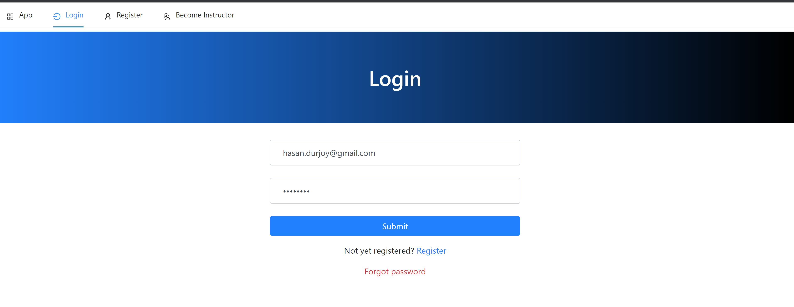

### Forgot Password:

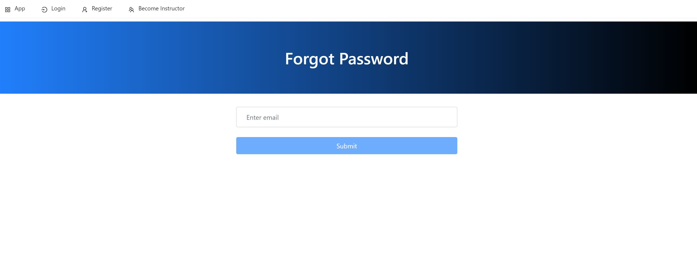

### Within Instructor's account:

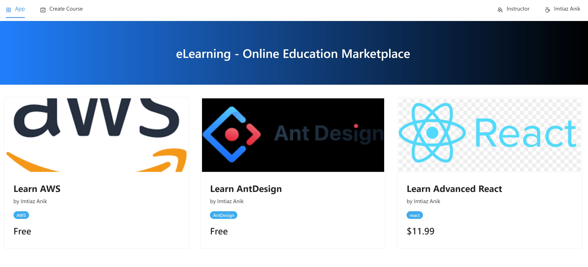
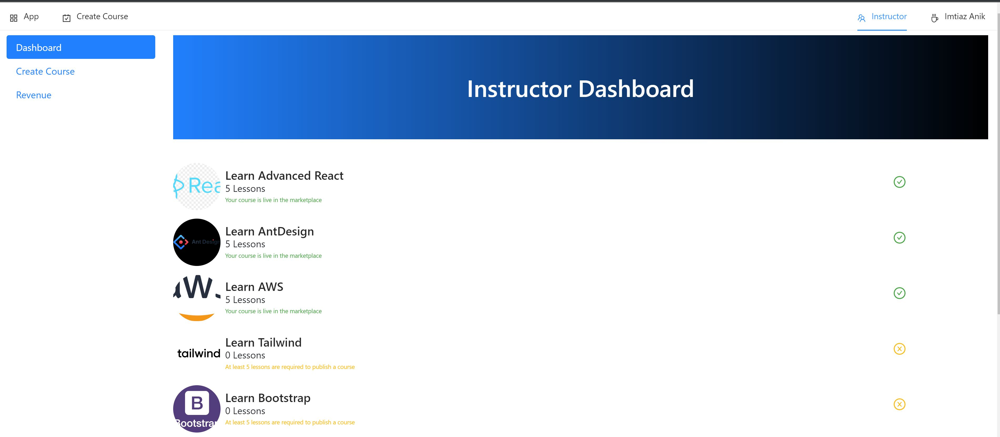
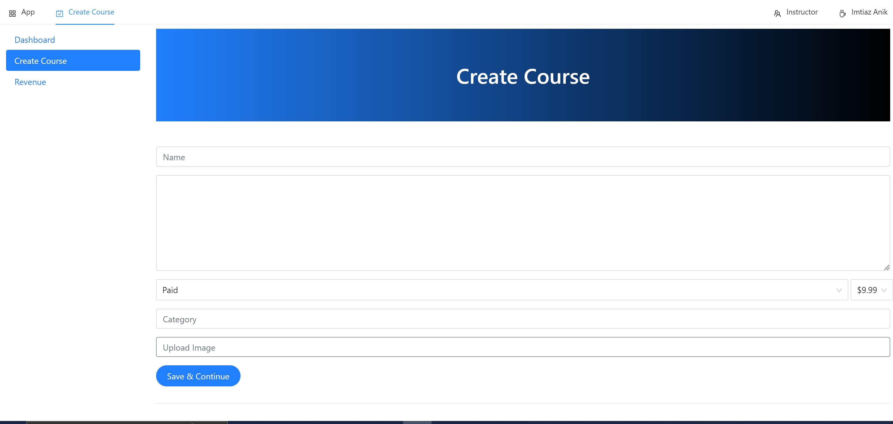
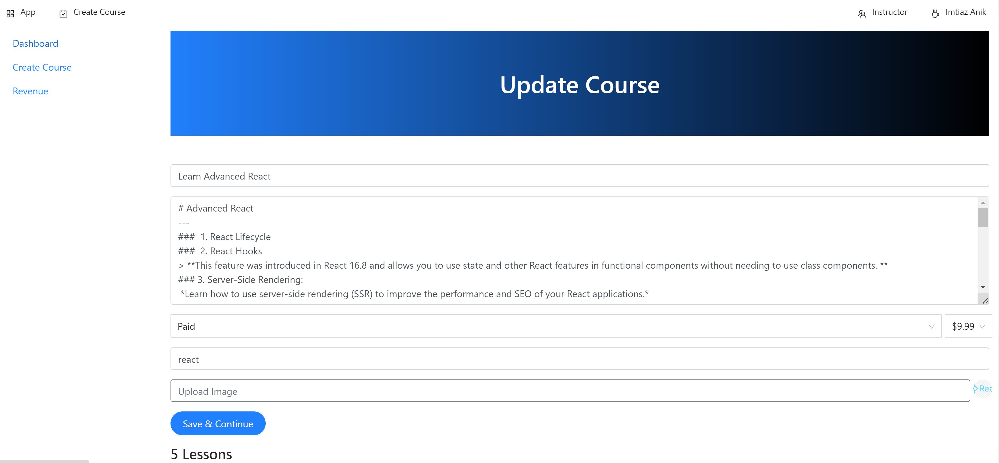
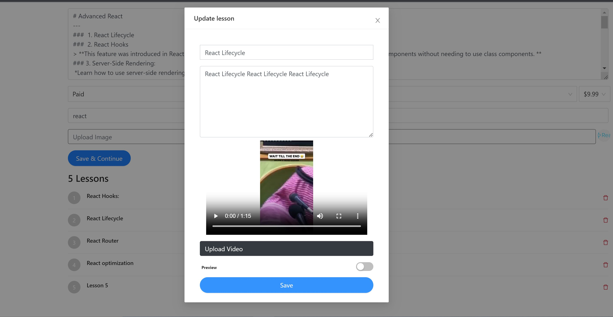
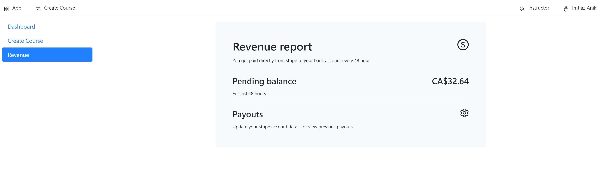

### Within user's account:

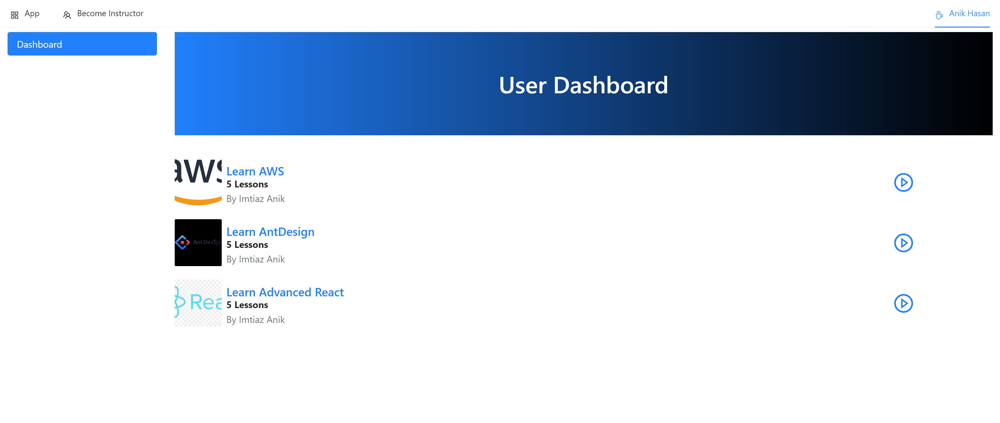
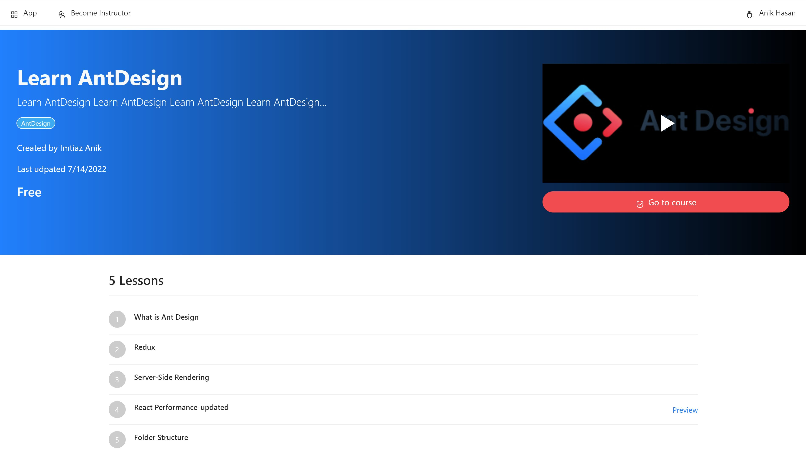

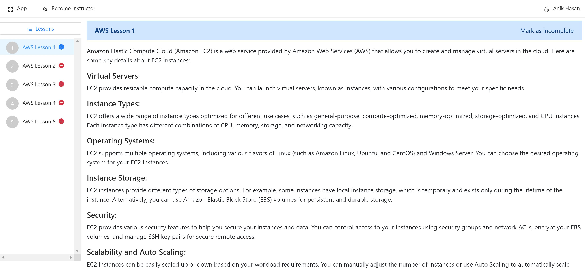
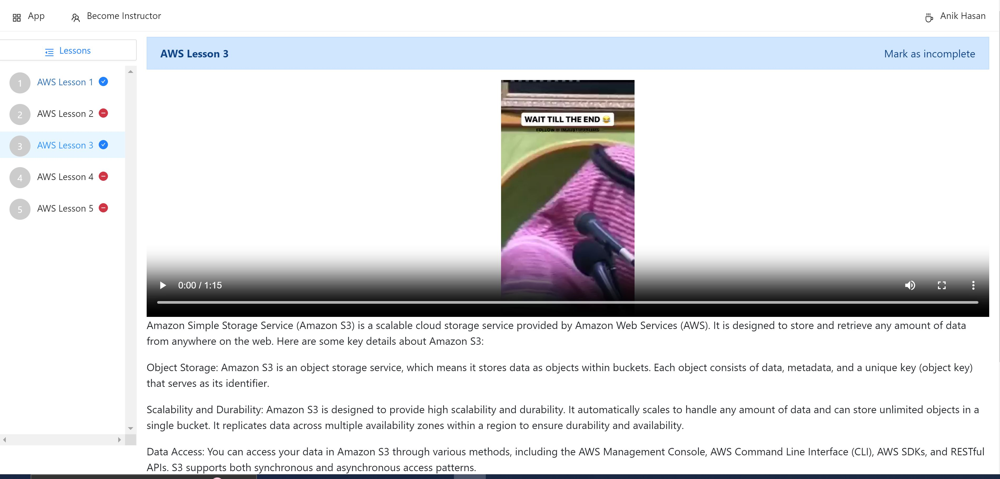
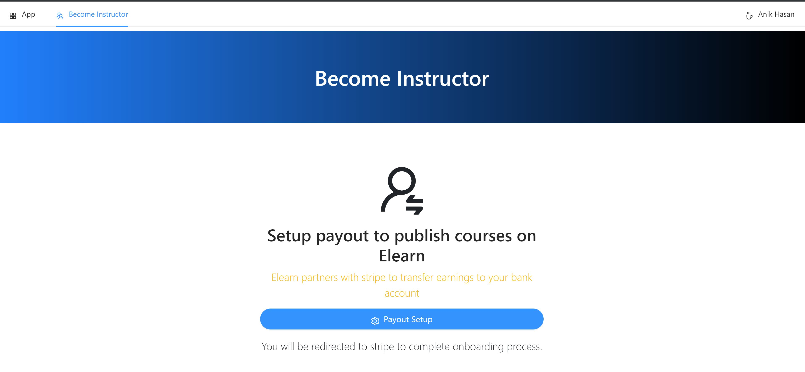
